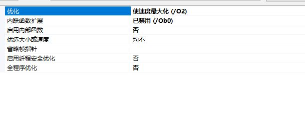

# Introduction

## speed_histogram_algorithm_framework 

- 局部直方图加速框架，内部使用了一些近似计算及指令集加速(SSE)，可以快速处理中值滤波、最大值滤波、最小值滤波、表面模糊等算法。

#### PC的CPU为I7-8770，64位。

#### OpenCV版本为3.4.0

#### 速度测试时，跑了50个loop。

#### 测试速度时VS的配置图如下：

- speed_rgb2gray_sse.cpp 使用sse加速RGB和灰度图转换算法，相比于OpenCV系统函数有2-3倍加速。算法原理：https://blog.csdn.net/just_sort/article/details/94456945 。速度测试结果如下：

|优化方式|图像分辨率|速度|
|---------|----------|----|
|C语言实现+单线程|4032*3024|9.39ms|
|4次循环展开+单线程|4032*3024|8.74ms|
|SSE优化+单线程|4032*3024|4.57ms|

- speed_gaussian_filter_sse.cpp 使用sse加速高斯滤波算法。算法原理：https://blog.csdn.net/just_sort/article/details/95212099 。速度测试效果如下：

| 优化方式| 图像分辨率 | 速度 |
| ------------------- | ---------- | ---- |
| C语言普通实现+单线程 | 4032*3024  | 290.43ms |
| SSE优化+单线程      | 4032*3024  | 265.96ms |

- speed_integral_graph_sse.cpp 使用SSE加速积分图运算，但是在PC上并没有速度提升，算法原理请看：https://www.cnblogs.com/Imageshop/p/6897233.html 。速度测试结果如下：

|优化方式|图像分辨率 |速度|
|---------|----------|-------|
|C语言实现+单线程|4032*3024|66.66ms|
|C语言实现+4线程|4032*3024|65.34ms|
|SSE优化+单线程|4032*3024|66.10ms|
|SSE优化+4线程|4032*3024|66.20ms|

- speed_vibrance_algorithm.cpp 使用SSE加速自然饱和度算法，加速幅度巨大，算法原理请看：https://blog.csdn.net/just_sort/article/details/95998524 。速度测试结果如下：

|优化方式|图像分辨率 |速度|
|---------|----------|-------|
|C语言实现+单线程|4032*3024|70.17ms|
|浮点数改成整形运算+单线程|4032*3024|36.30ms|
|SSE优化+单线程|4032*3024|8.72ms|

- speed_sobel_edgedetection_sse.cpp 使用SSE加速Sobel边缘检测算法，加速幅度巨大，算法原理请看：https://blog.csdn.net/just_sort/article/details/96282437 。速度测试结果如下：

|优化方式|图像分辨率 |速度|
|---------|----------|-------|
|C语言实现+单线程|4032*3024|192.01|
|浮点数改成整形运算+单线程|4032*3024|91.20|
|SSE优化+单线程|4032*3024|21.14|

- speed_skin_detection_sse.cpp 使用SSE加速肤色检测算法，加速幅度较大，算法原理请看：https://blog.csdn.net/just_sort/article/details/96480275 。速度测试结果如下：

|优化方式|图像分辨率 |速度|
|---------|----------|-------|
|C语言实现+单线程|4272*2848|20.19|
|SSE优化+单线程|4272*2848|4.22|

- speed_common_functions.cpp 对图像处理的一些常用函数的快速实现，个别使用了SSE优化。
- speed_max_filter_sse.cpp 使用speed_histogram_algorithm_framework框架实现最大值滤波，半径越大越明显。原理请看：https://blog.csdn.net/just_sort/article/details/97280807 。运行的时候记得把工程属性中的sdl检查关掉，不然会报一个变量未初始化的错误。速度测试效果如下:

|优化方式|图像分辨率 |半径|速度|
|---------|----------|-------|-------|
|C语言实现+单线程|4272*2848|7|9445.90ms|
|SSE优化+单线程|4272*2848|7|2234.55ms|
|C语言实现+单线程|4272*2848|9|14468.76ms|
|SSE优化+单线程|4272*2848|9|2221.68ms|
|C语言实现+单线程|4272*2848|11|23069.10ms|
|SSE优化+单线程|4272*2848|11|2180.95ms|

- speed_box_filter_sse.cpp 使用speed_histogram_algorithm框架实现O(1)最大值滤波，使用了SSE优化，算法原理请看：https://blog.csdn.net/just_sort/article/details/98075712 。运行方法和speed_max_filter_sse.cpp相同，速度测试结果如下：

|优化方式|图像分辨率 |半径|速度|
|---------|----------|-------|-------|
|C语言实现+单线程|4272*2848|11|163.16|
|SSE优化+单线程|4272*2848|11|123.83|
|C语言实现+单线程|4272*2848|21|167.81|
|SSE优化+单线程|4272*2848|21|126.98|
|C语言实现+单线程|4272*2848|31|168.62|
|SSE优化+单线程|4272*2848|31|126.17|

- speed_multi_scale_detail_boosting_see.cpp 在speed_box_filter_sse.cpp提供的盒子滤波sse优化的基础上，进一步使用指令集实现了对论文《DARK IMAGE ENHANCEMENT BASED ON PAIRWISE TARGET CONTRAST AND MULTI-SCALE DETAIL BOOSTING》的算法优化。算法原理请看：https://blog.csdn.net/just_sort/article/details/98485746  。在CoreI7-3770速度测试结果如下：

|优化方式|图像分辨率 |半径|速度|
|---------|----------|-------|-------|
|C语言实现+单线程|4272*2848|7|206.00|
|SSE优化+单线程|4272*2848|7|57.12|
